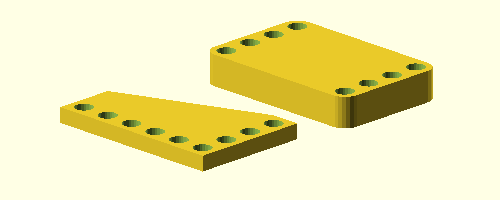
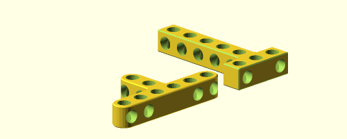
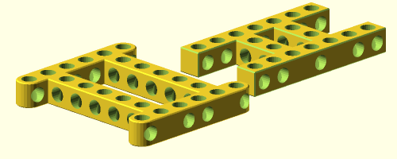
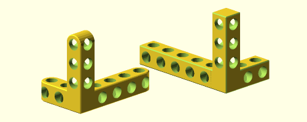

Bitbeam-lib
===========
Openscad Bitbeam library for easy create `Bitbeam <https://bitbeam.org/>`_,  `M-Bitbeam <http://www.tfsoft.cz/m-bitbeam/>`_, LEGO® Technic or Clementoni® compatible parts.

I create this library because some other libraries don't have all what i want. First I create my own extends, that i create one library with full functionality which I want.

Variables
---------
:unit:  Is size of one bit in millimeters, which is **8** for Bitbeam or LEGO® by default. Clementoni® parts have **9**.
:hole:  Hole diameter in millimeters, which is **4.8**.
:rim:   When is set to ``true``, all holes have rim, like LEGO® Technic parts. Default value is **false**.
:rim_h: Rim height in millimeters, which is **1**.
:rim_d: Rim diameter in millimeters, which is **6**.
:$fn:   Openscad number of fragments used by holes and ``cylinder_`` parts. Library set this to **25**.

Parts
-----
All parts have some required parameters, and some optional name parameters. There are one parametres for all parts ``h``.

h : float
  Height multiplier for part. Default value is **1**. When value is less then 1, side holes are never generated. When value is less then 0.27, rim are never generated.
side_holes : bool
  Some parts, could have side_holes, which is **true** by default. When parameter is set to false, no side holes are generated.
skip, skip_side: vector
  Some parts, could have easy way to skip some holes. This parameters are vector of indexes, start from zero, which holes could be skipped.

There are tho groups of parts, one with prefix ``cube_`` and one with prefix ``cylinder_``. The difference is with starts and stops of parts. Cylinder looks more like LEGO® Technic parts.

holes
`````
.. figure:: img/rim.png
  :alt: holes with rim example
  :align: center
  :figwidth: 100%

.. code:: c++

  holes(size, h=1, skip=[]);

Holes module is used in parts. Holes start from center with ``unit`` space. For more details about height, rim and skip, see `parts`_ start.

arm
```
.. figure:: img/arm.png
  :alt: arm example
  :align: center
  :figwidth: 100%

.. code:: c++

  cube_arm(size, h=1, side_holes=true, skip=[], skip_side=[]);
  cylinder_arm(holes, h=1, side_holes=true, skip=[], skip_side=[]);
  mix_arm(holes, h=1, side_holes=true, skip=[], skip_side=[]);

Arm modules are the base modules. They generate plain part with long ``site*unit`` with holes. Center of arm is in center of first bit. Special ``mix_arm`` start as a ``cube`` but end as ``cylinder``.

size : number
  Length of part in units.
h : float number
  Height multiplier for part, that means Z value.
side_holes : bool
  When is false, no side_holes will be generated.
skip : vector
  Vector of holes indexes from 0, which will be not generated.
skip_side : vector
  Like skip, but for side holes.

angle
`````
.. figure:: img/angle.png
  :alt: angle example
  :align: center
  :figwidth: 100%

.. code:: c++

  cube_angle(left, right, angle=45, h=1, side_holes=true);
  cylinder_angle(left, right, angle=45, h=1, side_holes=true);

Angle modules create parts from two arms ``left`` and ``right``, which are in ``180-angle`` angle. That is standard for tube nodes. Center of arm is in center of middle bit. As you can see in example, middle bit are shared of both left, and right arm. This middle bit never have side hole.

left : number
  Length of left part arm.
right : number
  Length of right part arm.
angle : number
  Degrees of angle between arms.

frame
`````
.. figure:: img/frame.png
  :alt: frame example
  :align: center
  :figwidth: 100%

.. code:: c++

  cube_frame(x, y, h=1, side_holes=true);
  cylinder_frame(x, y, h=1, side_holes=true);

Frame modules crate frame from four arms without side hole in corners.

base
````
.. figure:: img/base.png
  :alt: bae example
  :align: center
  :figwidth: 100%

.. code:: c++

  cube_base(x, y, x2=0, h=1, fill_holes=true);
  cylinder_base(x, y, x2=0, h=1, fill_holes=true);

Base modules can create two type of base parts. First is like frame with fill, second is trapezoid.

x2 : number
  If is **0**, which is default, that will create cuboid with parallel sides, but when is another than x, that create trapezoid.
fill_holes : bool
  If is set to **true**, which is default, base will be full of holes. Otherwise only squared arms will have holes. Side holes are not in trapezoidal side, and all holes ends in front of this side.

plate
`````


.. code:: c++

  cube_plate(x, y, x2=0, h=1, holes=[0, 1, 2, 3]);
  cylinder_plate(x, y, x2=0, h=1, holes=[0, 1, 2, 3]);

Plate modules are similar to `base`_ modules but with other interface and other functionality. Modules create block with size ``x`` and ``y``. And could be create triangle with ``x2=1`` value.

x2 : number
  If is **0**, which is default, that will create cuboid with parallel sides, but when is another than x, that create trapezoid.
holes : vector
  Holes are index of sides, start with zero, where holes will be generated. Default value is **[0, 1, 2, 3]** which holes on all sides. Holes on last trapezoidal side are rotated.

T (tee)
```````


.. code:: c++

  cube_t(x, y, h=1);
  cylinder_t(x, y, h=1);

T (tee from plumbing naming) generates Bitbeam T parts as you want.

x: number
  Size of "base" arm. Skipped side holes are set automatically by length.
y: number
  size of arm, which is plumb to "base" arm in the middle of it's length.

H (aitch)
`````````


.. code:: c++

  cube_t(x, y, shift=1, h=1);
  cylinder_t(x, y, shift=1, h=1);

H (aitch) generates generates H look like objects.

x: number
  Width of H part. Side holes opposite to plumb arms are skipped automatically.
y: number
  Depth of H part. These arms are shifted from ends.
shift: number
  Default value is 1, if is set to 0, the `frame`_ part is generated.

Y (wye)
```````


.. code:: c++

  cube_y(x, y, z, h=1);
  cylinder_y(x, y, z, h=1);

Y (wye) generates corner type part, which looks from some angles like Y. When
you set difference h, the external units are still right.

x: number
  Size of arm in X axis.
y: number
  Size of arm in Y axis.
z: number
  Size of arm in Z axis.