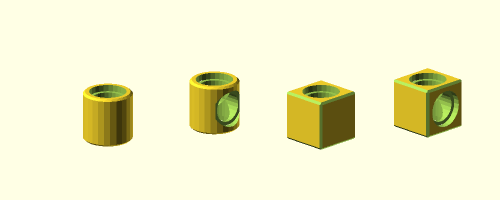
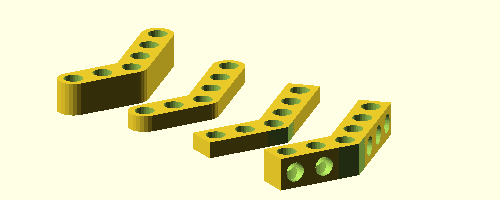
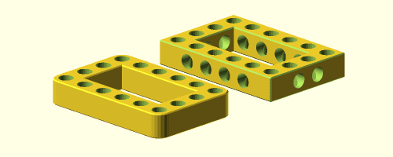
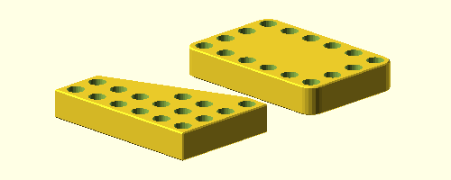

Bitbeam-lib
===========
Openscad Bitbeam library for easy create `Bitbeam <https://bitbeam.org/>`_,  `M-Bitbeam <http://www.tfsoft.cz/m-bitbeam/>`_, LEGO® Technic or Clementoni® compatible parts.

I create this library because some other libraries don't have all what i want. First I create my own extends, that i create one library with full functionality which I want.

Variables
---------
:unit:  Is size of one bit in millimeters, which is **8** for Bitbeam or LEGO® by default. Clementoni® parts have **9**.
:hole:  Hole diameter in millimeters, which is **4.8**.
:rim:   When is set to ``true``, all holes have rim, like LEGO® Technic parts. Default value is **false**.
:rim_h: Rim height in millimeters, which is **1**.
:rim_d: Rim diameter in millimeters, which is **6**.
:$fn:   Openscad number of fragments used by holes and ``cylinder_`` parts. Library set this to **25**.  

Parts
-----
All parts have some required parameters, and some optional name parameters. There are one parametres for all parts ``h``.

h : float
  Height multiplier for part. Default value is **1**. When value is less then 1, side holes are never generated. When value is less then 0.27, rim are never generated.
side_holes : bool
  Some parts, could have side_holes, which is **true** by default. When parameter is set to false, no side holes are generated.
skip, skip_side: vector
  Some parts, could have easy way to skip some holes. This parameters are vector of indexes, start from zero, which holes could be skipped.

There are tho groups of parts, one with prefix ``cube_`` and one with prefix ``cylinder_``. The difference is with starts and stops of parts. Cylinder looks more like LEGO® Technic parts.

holes
`````

  
.. code:: c++

  module holes(size, h=1, skip=[]);
  
Holes module is used in parts. Holes start from center with ``unit`` space. For more details about height, rim and skip, see `parts`_ start.

arm
```
.. figure:: img/arm.png
  :alt: arm example
  :align: center
  :figwidth: 100%

.. code:: c++

  module cube_arm(size, h=1, side_holes=true, skip=[], skip_side=[]);
  module cylinder_arm(holes, h=1, side_holes=true, skip=[], skip_side=[]);
  module mix_arm(holes, h=1, side_holes=true, skip=[], skip_side=[]);

Arm modules are the base modules. They generate plain part with long ``site*unit`` with holes. Center of arm is in center of first bit. Special ``mix_arm`` start as a ``cube`` but end as ``cylinder``.

size : number
  Length of part in units.
h : float number
  Height multiplier for part, that means Z value.
side_holes : bool
  When is false, no side_holes will be generated.
skip : vector
  Vector of holes indexes from 0, which will be not generated.
skip_side : vector
  Like skip, but for side holes.
  
angle
`````


.. code:: c++
  
  module cube_angle(left, right, angle=45, h=1, side_holes=true);
  module cylinder_angle(left, right, angle=45, h=1, side_holes=true);
  
Angle modules create parts from two arms ``left`` and ``right``, which are in ``180-angle`` angle. That is standard for tube nodes. Center of arm is in center of middle bit. As you can see in example, middle bit are shared of both left, and right arm. This middle bit never have side hole.

left : number
  Length of left part arm.
right : number
  Length of right part arm.
angle : number
  Degrees of angle between arms.
  
frame
`````


.. code:: c++
  
  module cube_frame(x, y, h=1, side_holes=true);
  module cylinder_frame(x, y, h=1, side_holes=true);
  
Frame modules crate frame from four arms without side hole in corners.
  
base
````


.. code:: c++

  module cube_base(x, y, h=1, quad=true, fill_holes=true);
  module cylinder_base(x, y, h=1, quad=true, fill_holes=true);
  
Base modules can create two type of base parts. First is like frame with fill, second is only triangle.

quad : bool
  If quad is false, triangle will be generated. Quad is **true** by default.
fill_holes : bool
  If is set to **true**, which is default, base will be full of holes. Otherwise only squared arms will have holes.